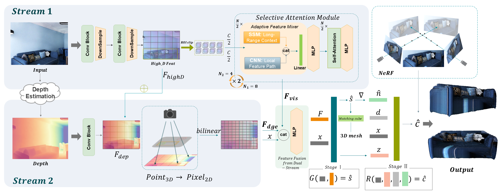

# Single-view 3D Scene Reconstruction with High-fidelity Shape and Texture (M3D Framework)

[](chrome-extension://efaidnbmnnnibpcajpcglclefindmkaj/https://arxiv.org/pdf/2411.12635)
[](https://arxiv.org/abs/2411.12635)

---

M3D is a high-fidelity framework for reconstructing 3D scenes and objects from a single RGB image. This framework combines state-of-the-art dual-stream feature extraction and depth-driven methodologies to deliver superior performance in challenging scenarios, such as virtual reality, autonomous driving, and robotics.



---

## Project Status

This project is currently in **active development**, with continuous refinements and improvements.

### Available Features:
- A basic code framework.
- Initial implementations of the key reconstruction modules.

### Planned Updates:
- Comprehensive testing and evaluation tools.
- Enhanced performance optimizations.
- Full support for large-scale scene editing and reconstruction.

We welcome contributions and suggestions to help improve the project further!

---

If you use this project or parts of the framework in your research, please consider citing:

```bibtex
@misc{zhang2024m3ddualstreamselectivestate,
      title={M3D: Dual-Stream Selective State Spaces and Depth-Driven Framework for High-Fidelity Single-View 3D Reconstruction}, 
      author={Luoxi Zhang and Pragyan Shrestha and Yu Zhou and Chun Xie and Itaru Kitahara},
      year={2024},
      eprint={2411.12635},
      archivePrefix={arXiv},
      primaryClass={cs.CV},
      url={https://arxiv.org/abs/2411.12635}, 
}
